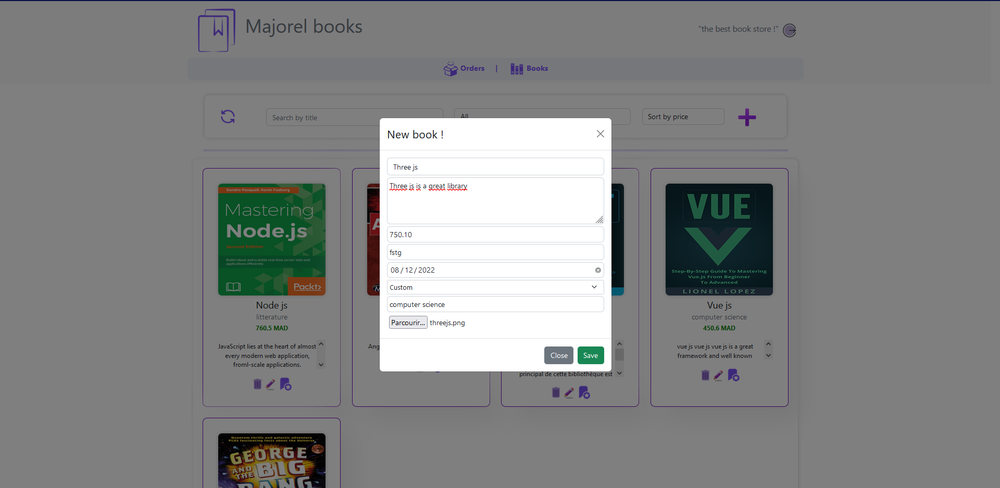
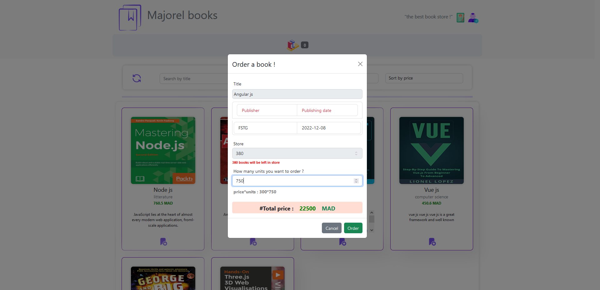
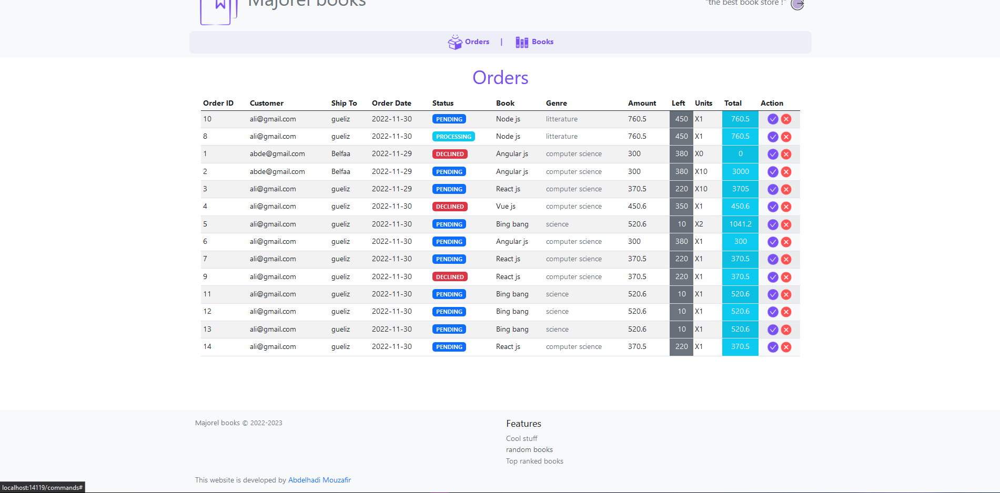

# Majorel books :books:

Bookery is a simple, easy to use, and free book management system. It is designed using react , node js and postgreSQL.

### Features

- Manage books
- Manage book categories
- Manage book orders
  
### Demo

_some screenshots_

### Author

- Abdelhadi Mouzafir
  
### Copyright

- 2022 Abdelhadi Mouzafir